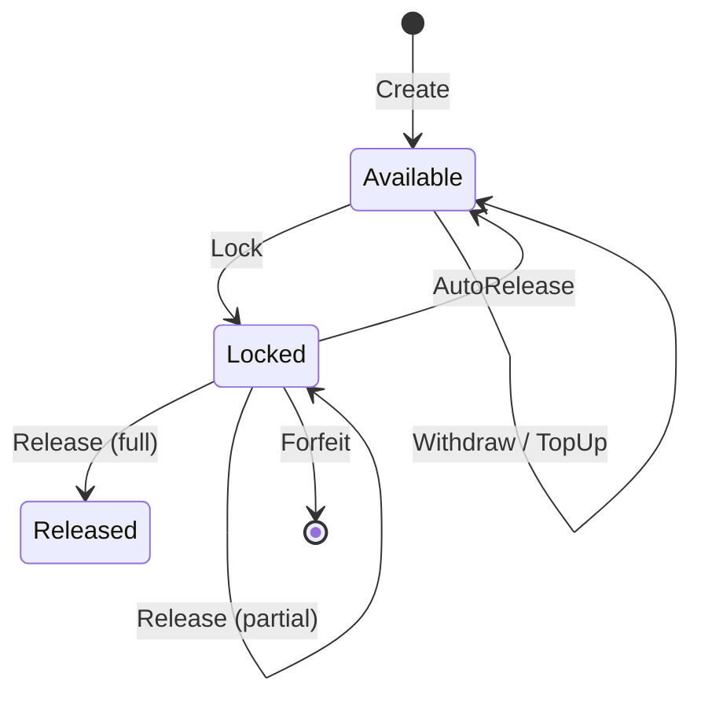

# Collateral

**Module:** `Collateral` | **LOC:** 309 | **Choices:** 7

Collateral management with mathematical invariant proof. Manages deposits, locks, releases, and forfeitures with a strict conservation law.

---

## Core Invariant

The contract enforces a conservation law on every state transition:

```
(currentAmount + lockedAmount) == initialAmount
```

This guarantees that collateral can never be created or destroyed through contract operations — only transferred between `available` and `locked` states, or explicitly withdrawn/forfeited.

## Templates

### ForfeitedCollateral

Created when collateral is forfeited to a beneficiary.

```haskell
template ForfeitedCollateral with
    beneficiary : Party           -- Party receiving forfeited funds
    asset : Asset                 -- Forfeited asset
    amount : Decimal              -- Forfeited amount
    sourceCollateralId : Text     -- Original collateral ID
    forfeitedAt : Time            -- Forfeiture timestamp
    reason : Text                 -- Forfeiture reason
    operator : Party              -- Platform operator
```

**Signatories:** `beneficiary`, `operator`

### Collateral

Main collateral management template.

```haskell
template Collateral with
    collateralId : Text           -- Unique collateral ID
    offerId : Optional Text       -- Related offer ID (if locked)
    operator : Party              -- Platform operator
    owner : Party                 -- Collateral owner
    beneficiary : Optional Party  -- Beneficiary if forfeited
    asset : Asset                 -- Collateral asset
    initialAmount : Decimal       -- Original deposited amount
    currentAmount : Decimal       -- Current available amount
    lockedAmount : Decimal        -- Amount currently locked
    lockedUntil : Optional Time   -- Lock expiration time
    status : CollateralStatus     -- Current status
    createdAt : Time
    updatedAt : Time
    auditors : [Party]
```

## Authorization

- **Signatories:** `owner`, `operator`
- **Observers:** `beneficiary` (if set) + `auditors`
- **Contract Key:** `(operator, collateralId)`

## Invariants

| Check | Rule |
|-------|------|
| Conservation | `(currentAmount + lockedAmount) == initialAmount` |
| Initial amount | `> 0.0` |
| Current amount | `>= 0.0` and `<= initialAmount` |
| Locked amount | `>= 0.0` and `<= initialAmount` |
| Asset amount | `== initialAmount` |
| If Locked | `lockedUntil` must be `Some` |
| If Available | `lockedAmount == 0.0` |

## Choices

### Lock

Lock collateral for a trade.

- **Controller:** `operator`
- **Validations:** Status `Available`, sufficient amount, positive amount, offer ID required, duration 0–365 days
- **Result:** Status → `Locked`, amounts recalculated

### Release

Release locked collateral back to owner.

- **Controller:** `operator`
- **Validations:** Status `Locked`, `amount <= lockedAmount`, positive amount
- **Result:** If all released → `Released`; otherwise stays `Locked`

### Forfeit

Forfeit collateral due to violation. Creates a `ForfeitedCollateral` record.

- **Controller:** `operator`
- **Validations:** Status `Locked`, `amount <= lockedAmount`, reason required
- **Result:** `ForfeitedCollateral` created for beneficiary, original archived

!!! info "Bug Fix P0-13"
    Added `ForfeitedCollateral` creation — previously forfeiture just archived without transferring to beneficiary.

### Withdraw

Owner withdraws available (unlocked) collateral.

- **Controller:** `owner`
- **Validations:** `currentAmount > 0`, `amount <= currentAmount`, positive amount
- **Post-condition:** Conservation invariant verified after withdrawal

!!! info "Bug Fix P0-14"
    Added explicit invariant check after withdrawal: `(newCurrentAmount + lockedAmount) == newInitialAmount`

### TopUp

Owner adds more collateral.

- **Controller:** `owner`
- **Validations:** Positive amount, deposit proof required
- **Result:** Both `initialAmount` and `currentAmount` increase

### AutoRelease

Automatically release expired locks.

- **Controller:** `operator`
- **Validations:** Status `Locked`, lock time expired

!!! info "Bug Fix P0-20"
    Changed `>` to `>=` for expiry comparison — allows release at exact expiry time, not just after.

## Lifecycle


