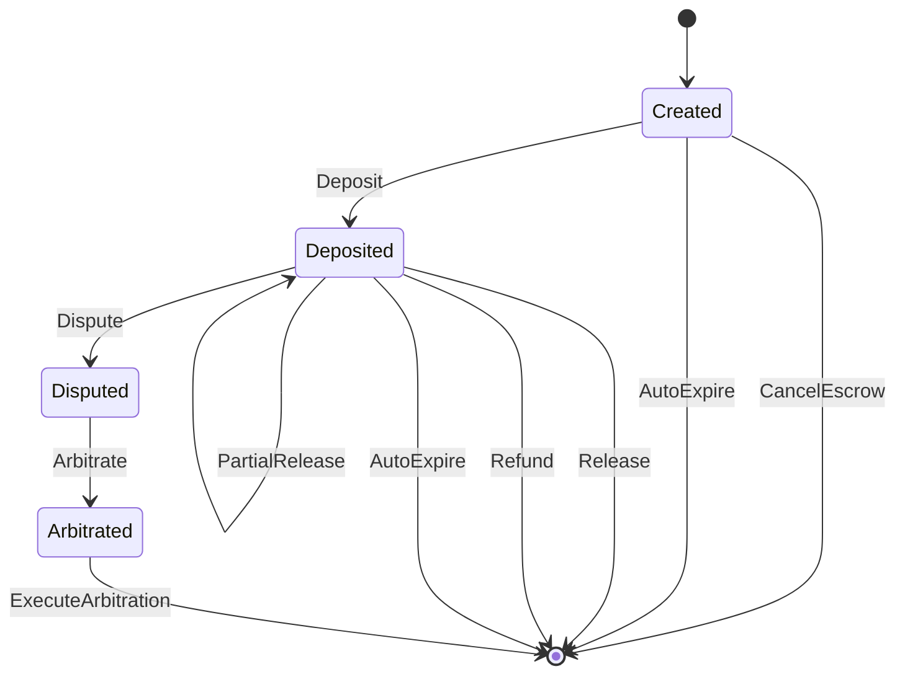

# Escrow

**Module:** `Escrow` | **LOC:** 358 | **Choices:** 10

Three-party escrow with arbiter for dispute resolution. The most feature-rich primitive with 10 distinct choices covering the full escrow lifecycle.

---

## Template Fields

```haskell
template Escrow with
    escrowId : Text               -- Unique escrow ID
    offerId : Text                -- Related offer ID
    tradeId : Optional Text       -- Related trade ID
    operator : Party              -- Platform operator
    buyer : Party                 -- Buyer (depositor)
    seller : Party                -- Seller (recipient)
    arbiter : Party               -- Neutral arbiter
    asset : Asset                 -- Asset in escrow
    amount : Decimal              -- Amount to be held
    depositedAmount : Decimal     -- Amount actually deposited
    releaseConditions : Text      -- Conditions for release
    refundConditions : Text       -- Conditions for refund
    status : EscrowStatus         -- Current status
    createdAt : Time
    updatedAt : Time
    deadline : Time               -- Escrow deadline
    extensionCount : Int          -- Deadline extensions used
    maxExtensions : Int           -- Max allowed extensions (default 3)
    disputeReason : Optional Text
    arbitrationDecision : Optional Text
    arbiterFavorsBuyer : Optional Bool
    auditors : [Party]
```

## Status Lifecycle

```haskell
data EscrowStatus
  = Created     -- Awaiting deposit
  | Deposited   -- Funds deposited
  | Released    -- Funds released to seller
  | Refunded    -- Funds refunded to buyer
  | Disputed    -- Under dispute
  | Arbitrated  -- Arbitration in progress
```



## Authorization

- **Signatory:** `operator`
- **Observers:** `buyer`, `seller`, `arbiter`, `auditors`
- **Contract Key:** `(operator, escrowId)`

## Invariants

| Check | Rule |
|-------|------|
| Amount | `> 0.0` |
| Deposited | `>= 0.0` and `<= amount` |
| IDs | Non-empty (`escrowId`, `offerId`, conditions) |
| Deadline | After creation time |
| Extensions | `count >= 0`, `max > 0`, `count <= max` |
| Status: Deposited | `depositedAmount == amount` |
| Status: Created | `depositedAmount == 0.0` |

## Choices (10)

### Deposit

Buyer deposits funds into escrow.

- **Controller:** `depositor` (must be `buyer`)
- **Validations:** Status is `Created`, amount matches, deadline not passed, proof required
- **Result:** Status → `Deposited`

### Release

Release all funds to seller.

- **Controller:** `releaser` (buyer or operator)
- **Validations:** Status is `Deposited`, proof required
- **Result:** Contract archived (funds released)

### PartialRelease

Release partial funds to seller, remainder stays in escrow.

- **Controller:** `releaser` (buyer or operator)
- **Validations:** Status is `Deposited`, `0 < amount <= depositedAmount`
- **Result:** New escrow with reduced `depositedAmount` and `amount`

### Refund

Refund deposited funds to buyer.

- **Controller:** `refunder` (seller or operator)
- **Validations:** Status is `Deposited`, reason required
- **Result:** Contract archived (funds refunded)

### Dispute

Raise a dispute on the escrow.

- **Controller:** `disputer` (buyer or seller)
- **Validations:** Status is `Deposited`, reason required
- **Result:** Status → `Disputed`

### Arbitrate

Arbiter makes a decision on the dispute.

- **Controller:** `arbitrator` (must be designated `arbiter`)
- **Validations:** Status is `Disputed` (fix P0-11), decision required
- **Result:** Status → `Arbitrated`, decision recorded

!!! warning "Bug Fix P0-11"
    Original code had inverted logic (`status /= Disputed` instead of `status == Disputed`). Fixed to correctly require disputed status.

### ExecuteArbitration

Execute the arbiter's ruling.

- **Controller:** `executor` (must be `operator`)
- **Validations:** Status is `Arbitrated` (fix P0-12), decision exists
- **Result:** If `favorBuyer == True` → refund; if `False` → release to seller

!!! warning "Bug Fix P0-12"
    Two fixes: (1) Inverted status check corrected. (2) Added actual `favorBuyer` routing logic — previously missing.

### CancelEscrow

Cancel escrow before deposit.

- **Controller:** `canceller` (buyer, seller, or operator)
- **Validations:** Status is `Created`, reason required
- **Result:** Contract archived

### ExtendDeadline

Extend the escrow deadline.

- **Controller:** `extender` (must be `operator`)
- **Validations:** Extensions not maxed out, new deadline after current
- **Result:** Deadline updated, `extensionCount` incremented

### AutoExpire

Automatically expire timed-out escrow.

- **Controller:** `expirer` (must be `operator`)
- **Validations:** Deadline passed, status is `Created` or `Deposited`
- **Result:** Contract archived
