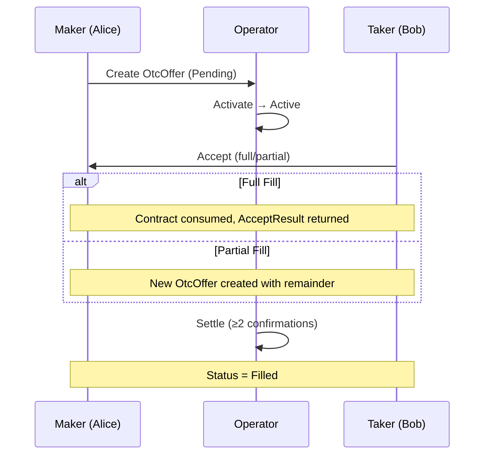

# OTC Offer

**Module:** `OtcOffer` | **LOC:** 278 | **Choices:** 6

The main OTC trading template. Represents an offer to buy or sell an asset with specific terms, supporting full and partial fills, expiration, and dispute resolution.

---

## Template Fields

```haskell
template OtcOffer with
    offerId : Text                      -- Unique offer identifier (UUID)
    operator : Party                    -- Platform operator
    initiator : Party                   -- Offer creator (maker)
    counterparty : Optional Party       -- Specific counterparty (None = public)
    asset : Asset                       -- Asset being traded
    price : Price                       -- Price terms
    quantity : Decimal                  -- Total quantity available
    side : OtcSide                      -- Buy or Sell
    limits : VolumeLimits              -- Min/max order size
    status : OtcStatus                  -- Current status
    timestamps : Timestamps             -- Creation and expiry
    collateral : Optional CollateralInfo
    settlementInfo : Optional SettlementInfo
    minComplianceLevel : Text           -- Required KYC level
    allowedJurisdictions : [Text]       -- Permitted jurisdictions
    auditors : [Party]                  -- Regulatory observers
```

## Authorization

- **Signatories:** `initiator`, `operator`
- **Observers:** `counterparty` (if specified) + `auditors`
- **Contract Key:** `(operator, offerId)` — maintainer: `operator`

## Invariants

The contract enforces on every state transition:

| Check | Rule |
|-------|------|
| Quantity | `> 0.0` |
| Min order | `> 0.0` |
| Max order | `>= min` and `<= quantity` |
| Price | `> 0.0` |
| Asset amount | `> 0.0` and `== quantity` |
| Offer ID | Non-empty |
| Expiry | If set, must be after creation time |
| Self-trade | Initiator cannot be the designated counterparty |
| Type invariants | `ensureAsset`, `ensurePrice`, `ensureVolumeLimits` |

## Choices

### Activate

Transition from `Pending` to `Active`.

| Property | Value |
|----------|-------|
| Controller | `activator` |
| Authorization | Only operator |
| Pre-condition | `status == Pending` |
| Post-condition | `status = Active` |

### Accept

Counterparty accepts the offer (full or partial fill).

| Property | Value |
|----------|-------|
| Controller | `acceptor` |
| Returns | `AcceptResult` |

**Validations:**

1. **Self-trade prevention** (P1-16) — `acceptor /= initiator`
2. **Expiry check** — current time must be before expiry
3. **Status check** — must be `Active` or `PartiallyFilled`
4. **Designated counterparty** — if set, only that party can accept
5. **Quantity limits** — within `minAmount..maxAmount` and `<= quantity`
6. **Compliance** — `complianceOk` must be `True`

**Partial Fill Logic (P1-19):**

When `requestedQuantity < quantity`, the contract:

1. Creates a new `OtcOffer` with `remainingQuantity = quantity - requestedQuantity`
2. Recalculates `maxAmount` for the remainder: `min(remainingQuantity, limits.maxAmount)`
3. Original contract is consumed

### Cancel

Initiator cancels their offer.

| Property | Value |
|----------|-------|
| Controller | `canceller` |
| Authorization | Initiator or operator |
| Pre-condition | `status /= Filled`, reason non-empty |
| Post-condition | Contract archived |

### Expire

Automatic expiration by operator.

| Property | Value |
|----------|-------|
| Controller | `operator` |
| Pre-condition | Expiry time set and `currentTime > expiresAt` |
| Post-condition | Contract archived |

### Settle

Complete settlement after payment confirmation.

| Property | Value |
|----------|-------|
| Controller | `settler` |
| Authorization | Only operator |
| Pre-condition | Settlement info exists, `confirmationCount >= 2` |
| Post-condition | `status = Filled`, settlement marked complete |

### Dispute

Raise a dispute on the offer.

| Property | Value |
|----------|-------|
| Controller | `disputer` |
| Authorization | Initiator, counterparty, or operator |
| Pre-condition | Reason non-empty |
| Post-condition | `status = Disputed` |

## Lifecycle


