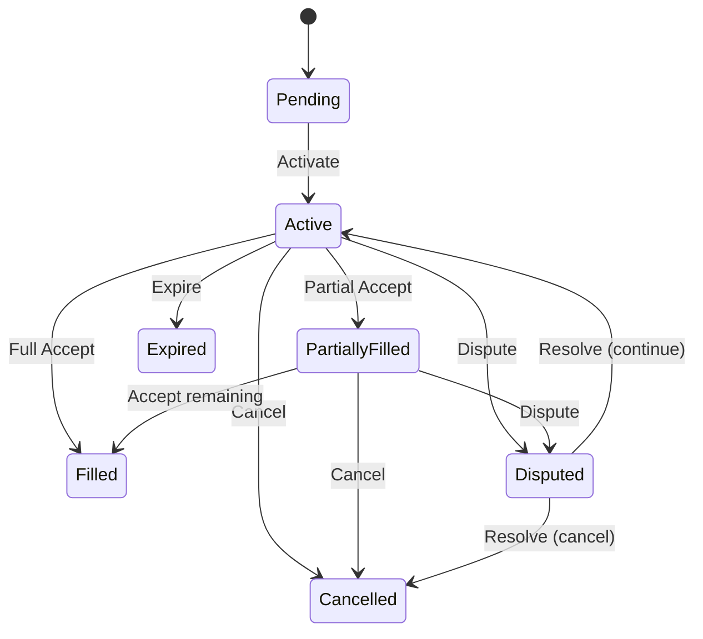

# OTC Types

**Module:** `OtcTypes` | **LOC:** 106

Core data types and structures shared across all OTC contracts.

---

## Data Types

### OtcSide

Trading direction.

```haskell
data OtcSide
  = Buy   -- Buy order
  | Sell  -- Sell order
```

### OtcStatus

Offer status lifecycle — defines all possible states of an OTC offer.

```haskell
data OtcStatus
  = Pending         -- Initial state, awaiting acceptance
  | Active          -- Active and can be filled
  | PartiallyFilled -- Partially executed
  | Filled          -- Fully executed
  | Cancelled       -- Cancelled by maker
  | Expired         -- Expired due to time
  | Disputed        -- Under dispute resolution
  | Rejected        -- Rejected by counterparty
```



### Asset

Multi-chain asset information.

```haskell
data Asset = Asset with
    symbol : Text              -- Asset symbol (e.g., "USDC", "ETH")
    amount : Decimal           -- Amount in base units
    chain : Text               -- Chain identifier ("Canton", "Ethereum")
    contractAddress : Optional Text  -- Contract address for tokens
```

**Invariant:** `amount >= 0.0`

### Price

```haskell
data Price = Price with
    rate : Decimal             -- Price per unit
    currency : Text            -- Currency denomination
```

**Invariant:** `rate > 0.0`

### VolumeLimits

```haskell
data VolumeLimits = VolumeLimits with
    minAmount : Decimal        -- Minimum order size
    maxAmount : Decimal        -- Maximum order size
```

**Invariant:** `minAmount > 0.0 && maxAmount > 0.0 && minAmount <= maxAmount`

### PartyInfo

Party information with cryptographic signature.

```haskell
data PartyInfo = PartyInfo with
    partyId : Party            -- Canton party identifier
    signature : Text           -- Ed25519 signature (hex encoded)
    publicKey : Text           -- Public key (hex encoded)
```

### Timestamps

```haskell
data Timestamps = Timestamps with
    created : Time             -- Creation timestamp
    updated : Time             -- Last update timestamp
    expiresAt : Optional Time  -- Expiration time (optional)
```

### SettlementInfo

```haskell
data SettlementInfo = SettlementInfo with
    settlementId : Text        -- Unique settlement identifier
    paymentProof : Text        -- Payment proof hash (SHA-256)
    confirmations : Int        -- Number of confirmations
    completedAt : Optional Time -- Settlement completion time
```

### CollateralStatus

```haskell
data CollateralStatus
  = CollateralAvailable    -- Available for locking
  | CollateralLocked       -- Locked for a trade
  | CollateralReleased     -- Released back to owner
  | CollateralForfeited    -- Forfeited due to violation
  | CollateralLiquidated   -- Liquidated
```

### CollateralInfo

```haskell
data CollateralInfo = CollateralInfo with
    collateralId : Text        -- Unique collateral identifier
    asset : Asset              -- Collateral asset
    lockedUntil : Time         -- Lock expiration time
    status : CollateralStatus  -- Current status
```

### AcceptResult

Result returned when an offer is accepted.

```haskell
data AcceptResult = AcceptResult with
    tradeId : Text             -- Generated trade identifier
    actualQuantity : Decimal   -- Actual filled quantity
    actualPrice : Decimal      -- Actual execution price
    settlementTime : Time      -- Settlement timestamp
    settlementId : Text        -- Associated settlement ID
    slippageBps : Int          -- Price slippage in basis points
```

## Invariant Functions

Each type has an `ensure*` function that validates invariants:

| Function | Checks |
|----------|--------|
| `ensureAsset` | `amount >= 0.0` |
| `ensurePrice` | `rate > 0.0` |
| `ensureVolumeLimits` | `min > 0`, `max > 0`, `min <= max` |
