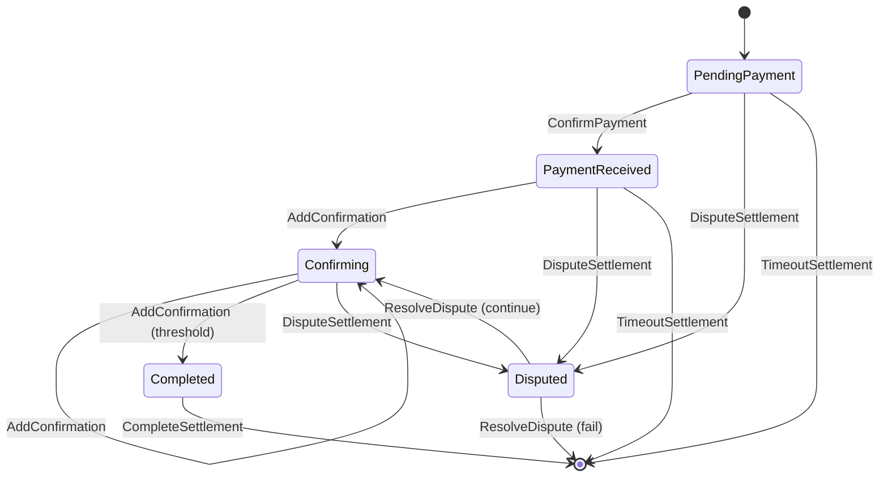

# Settlement

**Module:** `Settlement` | **LOC:** 308 | **Choices:** 8

Multi-confirmation settlement with dispute resolution. Tracks the payment confirmation process from initial payment through blockchain confirmations to final completion.

---

## Status Lifecycle

```haskell
data SettlementStatus
  = PendingPayment     -- Awaiting payment
  | PaymentReceived    -- Payment received, awaiting confirmation
  | Confirming         -- Confirming on blockchain
  | Completed          -- Settlement completed
  | Disputed           -- Under dispute
  | Failed             -- Settlement failed
```



## Template Fields

```haskell
template Settlement with
    settlementId : Text           -- Unique settlement ID
    offerId : Text                -- Related offer ID
    tradeId : Text                -- Related trade ID
    operator : Party              -- Platform operator
    buyer : Party                 -- Buyer party
    seller : Party                -- Seller party
    asset : Asset                 -- Asset being settled
    quantity : Decimal            -- Quantity being settled
    price : Price                 -- Settlement price
    totalAmount : Decimal         -- Total settlement amount
    paymentProof : Text           -- Payment proof hash (SHA-256)
    confirmations : Int           -- Current confirmations
    requiredConfirmations : Int   -- Required confirmations
    status : SettlementStatus
    createdAt : Time
    updatedAt : Time
    completedAt : Optional Time
    deadline : Time               -- Settlement deadline
    extensionCount : Int          -- Max 3 extensions
    auditors : [Party]
```

## Authorization

- **Signatory:** `operator`
- **Observers:** `buyer`, `seller`, `auditors`
- **Contract Key:** `(operator, settlementId)`

## Invariants

| Check | Rule |
|-------|------|
| Total amount | `totalAmount == quantity * price.rate` |
| Quantity | `> 0.0` |
| Price | `> 0.0` |
| Confirmations | `0 <= confirmations <= requiredConfirmations` |
| Extensions | `0 <= extensionCount <= 3` |
| IDs | All non-empty |
| Payment proof | Non-empty |
| Deadline | After creation |
| Completed time | If set, between creation and update |

## Choices

### ConfirmPayment

Buyer confirms payment was sent.

- **Controller:** `buyer`
- **Validations:** Status `PendingPayment`, deadline not passed, tx hash >= 32 chars
- **Result:** Status → `PaymentReceived`

### AddConfirmation

Add a blockchain confirmation.

- **Controller:** `operator`
- **Validations:** Status `PaymentReceived` or `Confirming`, not fully confirmed
- **Result:** Confirmation count incremented; auto-transitions to `Completed` when threshold reached

### CompleteSettlement

Finalize and archive the settlement.

- **Controller:** `operator`
- **Validations:** Sufficient confirmations, status `Completed`
- **Result:** Contract archived

### DisputeSettlement

Raise a dispute.

- **Controller:** buyer, seller, or operator
- **Validations:** Status is not `Completed`, reason required
- **Result:** Status → `Disputed`

### ResolveDispute

Resolve a dispute — continue or fail the settlement.

- **Controller:** `operator`
- **Validations:** Status is `Disputed` (fix P0-10), resolution required
- **Result:** If `continueSettlement` → `Confirming`; else → `Failed`

!!! warning "Bug Fix P0-10"
    Original code had inverted logic (`status /= Disputed` instead of `status == Disputed`). Fixed to correctly require disputed status.

### FailSettlement

Mark settlement as failed.

- **Controller:** `operator`
- **Validations:** Status is not `Completed`, reason required
- **Result:** Contract archived

### ExtendDeadline

Extend settlement deadline (max 3 times).

- **Controller:** `operator`
- **Validations:** `extensionCount < 3`, new deadline after current
- **Result:** Deadline updated, count incremented

### TimeoutSettlement

Auto-fail after deadline.

- **Controller:** `operator`
- **Validations:** Deadline passed, status `PendingPayment` or `PaymentReceived`
- **Result:** Contract archived
